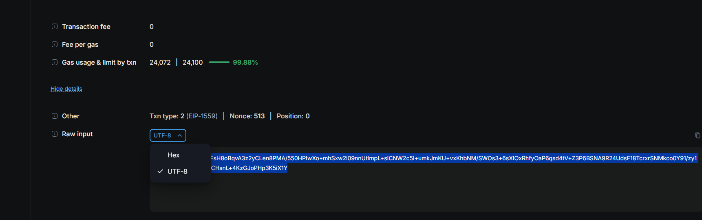

# **Testing Decryption of Data**

After running the encrypted script, you can test decryption of the data as follows:

1. **Locate the Explorer URL:**
   - The script outputs a transaction URL similar to:
     ```
     https://stability.blockscout.com/tx/0x08f1e46af563be6bcf5212c5a3823f46d2527d6ac0023646019e1e4e2735dc76
     ```

2. **Navigate to the URL:**
   - Open the transaction URL in your browser.

3. **Retrieve the Raw Input:**
   - Go to the **Data** section of the transaction.
     
   - Select **Raw Input** and ensure the format is set to **UTF-8**.
     
   - Copy the entire input string.

4. **Run the Decryption Command:**
   - Use the following command to decrypt the data (replace `YourSecurePassword` with your encryption password):
     ```bash
     echo "<raw_input_string>" | openssl enc -aes-256-cbc -a -A -d -salt -pass pass:<YourSecurePassword>
     ```

   - Example:
     ```bash
     echo "U2FsdGVkX198qCGFsH8oBqvA3z2yCLen8PMA/550HPIwXo+mhSxw2l09nnUtImpL+sICNW2c5I+umkJmKU+vxKhbNM/SWOs3+6sXIOxRhfyOaP6qsd4tV+Z3P6BSNA9R24UdsF18TcrxrSNMkco0Y91/zy1OQAbhknL8PM9bYuCHsnL+4KzGJoPHp3K5iX1Y" | openssl enc -aes-256-cbc -a -A -d -salt -pass pass:YourSecurePassword
     ```

5. **View the Output:**
   - The decrypted output will resemble the original event data:
     ```
     ServerID:888, User: testuser, IP: 127.0.0.1, Service: , Timestamp: 2025-01-20T07:32:23Z, SessionType: open_session
     
