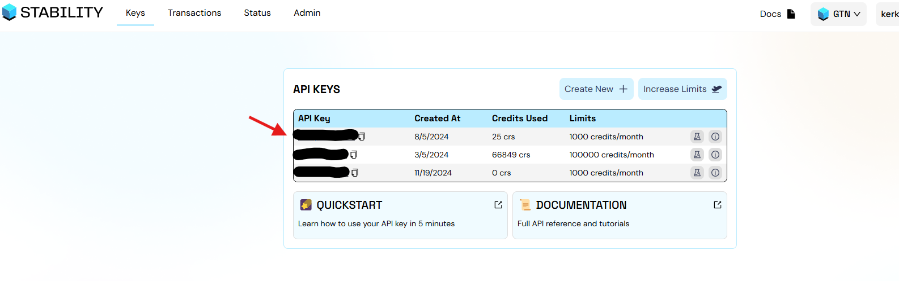
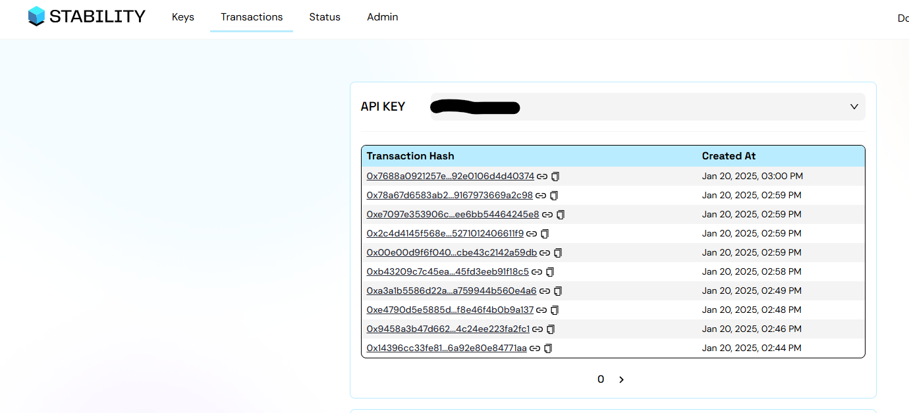

# **Viewing All Transactions Made**

Follow these steps to view all transactions made using your API key:

---

## **1. Use Your Own API Key**

Ensure you are using your own generated API key. If you are using the free "try-it-out" key, you will not be able to filter or have an overview of all your transactions since others may also be using the same key.

## **2. Access Your API Dashboard**

1. Navigate to [Stability Protocol API Dashboard](https://portal.stabilityprotocol.com/keys/).
2. Select the API key you used for submitting transactions.
   

---

## **3. View Your Transactions**

1. Once inside the dashboard, you will see an overview of all transactions submitted using your API key.
2. Locate the **Transaction Hashes** section to view the details of each transaction.

---

By following these steps, you can effectively monitor and verify all transactions submitted by your scripts using your personal API key.
